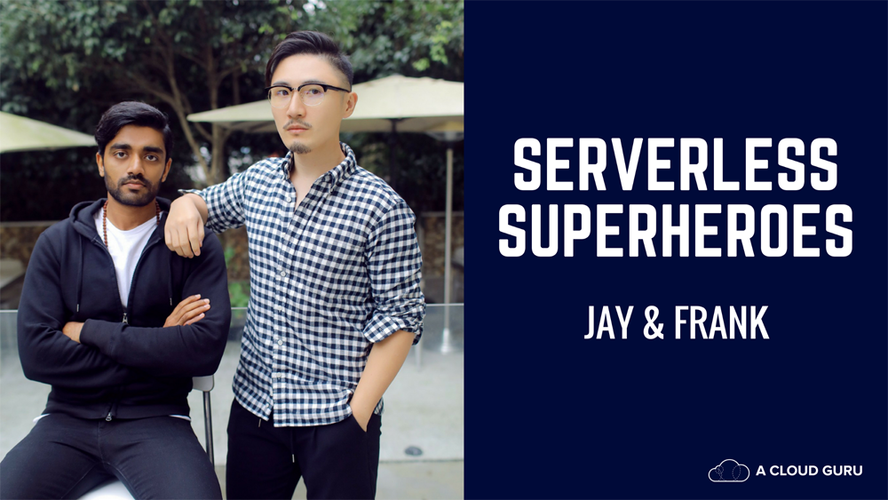

  

    <h1 class="title">Making it easy to build  and deploy Serverless apps</h1>
    
Our mission at Seed is to make it extremely easy and efficient for teams to build and deploy Serverless Framework projects on AWS. We want to make sure your team has everything they need to bring their Serverless projects to life.

  

  

  

    <h3>The Team</h3>
    
Seed is created by <a href="http://anoma.ly">Anomaly Innovations</a>. We've been on AWS for nearly a decade. We have built web apps, iPhone and Android apps, in a variety of different environments and languages. We use our knowledge and experience with the AWS to ensure that your team would not have to worry about the deployment of your serverless applications.

  

  

  

    <h3>Our Investors</h3>
    
We are lucky to have a great set of investors on our side including <a href="http://en.wikipedia.org/wiki/Russel_Simmons">Russ Simmons</a>, <a href="http://en.wikipedia.org/wiki/Max_Levchin">Max Levchin</a>, <a href="http://en.wikipedia.org/wiki/Reid_Hoffman">Reid Hoffman</a>, <a href="http://en.wikipedia.org/wiki/Steve_Chen_(YouTube)">Steve Chen</a>, <a href="http://en.wikipedia.org/wiki/James_Hong_%28entrepreneur%29">James Hong</a>, <a href="http://en.wikipedia.org/wiki/SV_Angel">SV Angel</a> and a few others.

    

      
      
    

  

  

  

    <h3>The Community</h3>
    
We are also authors of <a href="https://serverless-stack.com">Serverless Stack</a>; the most popular resource for building full-stack serverless applications. We've helped hundreds of folks get started with serverless. We have also worked with dozens of teams to understand their needs and use cases.

    
Everything we learn from the community in the form of best practises goes into making Seed better. And everything we learn while working on Seed, we give back to the community through Serverless Stack.

  

  

  

    <h3>In the press</h3>
    
    

      <a href="https://read.acloud.guru/serverless-superheroes-jay-and-frank-are-keeping-the-original-promise-of-serverless-bb3a32f7b8f1">
        Serverless Superheroes: Jay and Frank are keeping the original promise of serverless
      </a>
    

  

  

  

    
<a href="mailto:{{ site.email }}">{{ site.email }}</a>

    
{{ site.tel }}

    
<a href="{{ site.twitter }}">@SEED_run</a>

    
<a href="https://s3.amazonaws.com/anomaly/Seed/Media+Kit.zip">Media Kit</a>

  

