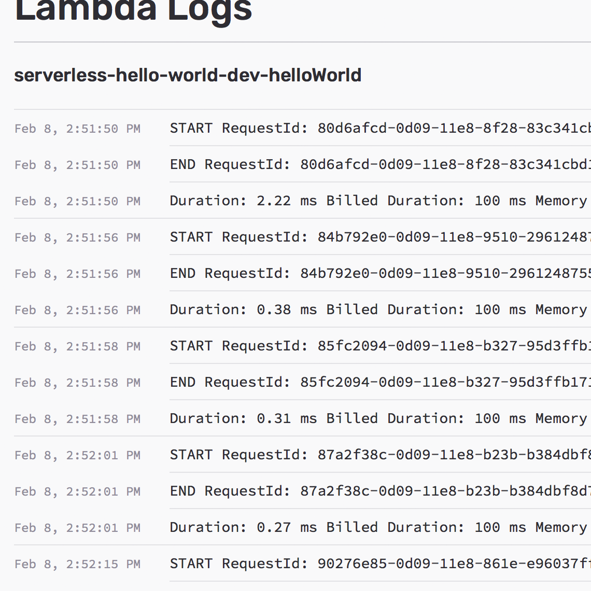

  <h1>Deploy, Manage, and Monitor Serverless Applications on AWS</h1>
  <h3>Seed manages pipelines, configures environments, and monitors deployments for Serverless Framework projects.</h3>
  

    <a class="demo" href="{{ site.console_url }}{{ site.signup }}">
      Request a demo
    </a>
    <a class="action" href="{{ site.console_url }}{{ site.signup }}">
      Sign up for free
    </a>
  

  

    

    

  

  

    <iframe
      src="https://player.vimeo.com/video/253137697?badge=0"
      width="100%"
      height="100%"
      frameborder="0"
      allowfullscreen>
    </iframe>
  

  <h4>Nothing to configure. Nothing to install.</h4>
  
Simply link your Git repository and IAM credentials and you can `git push` to deploy updates to your Serverless app. Create multiple environments for your team, configure custom domains, view Lambda/API Gateway logs right from the Seed console.

  

    

      
      <i title="Bitbucket" class="fa fa-bitbucket" aria-hidden="true"></i>
      <i title="GitHub" class="fa fa-github" aria-hidden="true"></i>
      <i title="GitLab" class="fa fa-gitlab" aria-hidden="true"></i>
      
    

  

  

    

      

        <i class="fa fa-code-fork" aria-hidden="true"></i>
      

      <h2>Automated Deployments</h2>
      
Seed is a fully-configured code pipeline for Serverless Framework projects on AWS. Here are a few ways Seed can help you with deployments:

      <ul class="fa-ul">
        <li>
          <i class="fa-li fa fa-check-circle-o" aria-hidden="true"></i>
          <a href="/docs/running-tests.html">
            Automatically runs your tests
          </a>
        </li>
        <li>
          <i class="fa-li fa fa-check-circle-o" aria-hidden="true"></i>
          <a href="/docs/adding-build-notifications.html">
            Slack &amp; email build notifications
          </a>
        </li>
        <li>
          <i class="fa-li fa fa-check-circle-o" aria-hidden="true"></i>
          <a href="/docs/promoting-to-production.html">
            Review before promoting to production
          </a>
        </li>
        <li>
          <i class="fa-li fa fa-check-circle-o" aria-hidden="true"></i>
          <a href="/docs/promoting-to-production.html">
            Rollback deploys without rebuilding them
          </a>
        </li>
      </ul>
    

    

      
    

  

  

  

    

      

        <i class="fa fa-cogs" aria-hidden="true"></i>
      

      <h2>Manage Environments</h2>
      
Create and configure multiple environments for your team. Environments in Seed are based on the stages in Serverless Framework with all the perks:

      <ul class="fa-ul">
        <li>
          <i class="fa-li fa fa-check-circle-o" aria-hidden="true"></i>
          <a href="/docs/configuring-stage-variables.html">
            Add environment variables
          </a>
        </li>
        <li>
          <i class="fa-li fa fa-check-circle-o" aria-hidden="true"></i>
          <a href="/docs/storing-secrets.html">
            Store secrets through the console
          </a>
        </li>
        <li>
          <i class="fa-li fa fa-check-circle-o" aria-hidden="true"></i>
          <a href="/docs/updating-the-stage-source.html">
            Update the branch that is deployed
          </a>
        </li>
        <li>
          <i class="fa-li fa fa-check-circle-o" aria-hidden="true"></i>
          <a href="/docs/working-with-pull-requests.html">
            Automatically preview pull requests
          </a>
        </li>
        <li>
          <i class="fa-li fa fa-check-circle-o" aria-hidden="true"></i>
          <a href="/docs/configuring-custom-domains.html">
            Custom domains for stage endpoints
          </a>
        </li>
      </ul>
    

    

      
    

  

  

  

    

      

        <i class="fa fa-tachometer" aria-hidden="true"></i>
      

      <h2>Monitoring Deployments</h2>
      
Once your deployments are live, Seed can pull up detailed information on the deployed stack. And give you a live look at what is going on.

      <ul class="fa-ul">
        <li>
          <i class="fa-li fa fa-check-circle-o" aria-hidden="true"></i>
          <a href="/docs/viewing-logs.html">
            Access &amp; Lambda logs
          </a>
        </li>
        <li>
          <i class="fa-li fa fa-check-circle-o" aria-hidden="true"></i>
          <a href="/docs/storing-secrets.html">
            Lambda &amp; API CloudWatch Metrics
          </a>
        </li>
      </ul>
    

    

      
    

  

  

  

    

      <i class="fa fa-list-alt" aria-hidden="true"></i>
    

    

      <h4>Large Serverless Projects?</h4>
      

        Working on a mono-repo or multi-repo Serverless project and would like to use Seed? We are currently adding support for larger projects. Contact us for early access.
      

      <a href="mailto:{{ site.email }}">
        Request early access
      </a>
    

  

  

    

      <h6>Amazing support</h6>
      
&ldquo;I just completed your tutorial on the Serverless stack, and it was fantastic. It was carefully thought out, well-written, and incredibly thorough. You guys rock!&rdquo;

      

        
Daniel Chen

        
CTO, <a href="https://myshyft.com">Shyft</a>

      

    

    

      <h6>Saves a lot of time</h6>
      
&ldquo;This is the best and most comprehensive fullstack serverless tutorial available. Take the time to go through every step, you will learn a ton!&rdquo;

      

        
Patrick Star

        
CEO, <a href="https://myshyft.com">Krabby Inc.</a>

      

    

  

  <h4 id="pricing">Pricing</h4>
  

    

      

        

          Free
        

        

          
$0

          
per month

        

      

      <ul class="features fa-ul">
        <li>
          <i class="fa-li fa fa-check"></i>
          Unlimited users
        </li>
        <li>
          <i class="fa-li fa fa-check"></i>
          Unlimited projects
        </li>
        <li>
          <i class="fa-li fa fa-check"></i>
          Unlimited concurrent builds
        </li>
        <li>
          <i class="fa-li fa fa-long-arrow-right"></i>
          15 deploys per month
        </li>
      </ul>
    

    

      

        

          Startup
        

        

          
$7

          
per month

        

      

      <ul class="features fa-ul">
        <li>
          <i class="fa-li fa fa-check"></i>
          Unlimited users
        </li>
        <li>
          <i class="fa-li fa fa-check"></i>
          Unlimited projects
        </li>
        <li>
          <i class="fa-li fa fa-check"></i>
          Unlimited concurrent builds
        </li>
        <li>
          <i class="fa-li fa fa-long-arrow-right"></i>
          60 deploys per month
        </li>
        <li>
          <i class="fa-li fa fa-circle-thin"></i>
          Add 60 deploys for $7
        </li>
      </ul>
    

    

      

        

          Standard
        

        

          
$47

          
per month

        

      

      <ul class="features fa-ul">
        <li>
          <i class="fa-li fa fa-check"></i>
          Unlimited users
        </li>
        <li>
          <i class="fa-li fa fa-check"></i>
          Unlimited projects
        </li>
        <li>
          <i class="fa-li fa fa-check"></i>
          Unlimited concurrent builds
        </li>
        <li>
          <i class="fa-li fa fa-long-arrow-right"></i>
          600 deploys per month
        </li>
        <li>
          <i class="fa-li fa fa-plus"></i>
          Email support
        </li>
      </ul>
    

    

      

        

          Premium
        

        

          
$197

          
per month

        

      

      <ul class="features fa-ul">
        <li>
          <i class="fa-li fa fa-check"></i>
          Unlimited users
        </li>
        <li>
          <i class="fa-li fa fa-check"></i>
          Unlimited projects
        </li>
        <li>
          <i class="fa-li fa fa-check"></i>
          Unlimited concurrent builds
        </li>
        <li>
          <i class="fa-li fa fa-long-arrow-right"></i>
          3000 deploys per month
        </li>
        <li>
          <i class="fa-li fa fa-plus"></i>
          Priority email support
        </li>
      </ul>
    

    

      

        

          Pro
        

        

          
$997

          
per month

        

      

      <ul class="features fa-ul">
        <li>
          <i class="fa-li fa fa-check"></i>
          Unlimited users
        </li>
        <li>
          <i class="fa-li fa fa-check"></i>
          Unlimited projects
        </li>
        <li>
          <i class="fa-li fa fa-check"></i>
          Unlimited concurrent builds
        </li>
        <li>
          <i class="fa-li fa fa-long-arrow-right"></i>
          18000 deploys per month
        </li>
        <li>
          <i class="fa-li fa fa-plus"></i>
          Priority email support
        </li>
        <li>
          <i class="fa-li fa fa-plus"></i>
          Video call consultations
        </li>
        <li>
          <i class="fa-li fa fa-plus"></i>
          Required two-factor auth Coming soon
        </li>
        <li>
          <i class="fa-li fa fa-plus"></i>
          Multi-level user roles Coming soon
        </li>
      </ul>
    

  

  

    
{{ site.tel }}

    

      <a class="demo" href="{{ site.console_url }}{{ site.signup }}">
        Request a demo
      </a>
      <a class="action" href="{{ site.console_url }}{{ site.signup }}">
        Sign up for free
      </a>
    

  

  

    

      There are soft limits on build storage and total build minutes. <a href="mailto:{{ site.email }}">Contact us</a> if you have any questions or have custom requirements.
    

  

  
Seed is created by the trusted folks behind <a target="_blank" href="http://serverless-stack.com">Serverless-Stack.com</a>,  the best resource for building serverless apps on AWS.

  

    

      

      &amp;
    

  

  
Stay up to date with product updates from Seed

  <a class="button" href="{{ site.newsletter_signup_form }}" target="_blank">
    Subscribe to our newsletter
  </a>
   
  <a class="button" href="{{ site.twitter }}" target="_blank">
    Follow us on Twitter
  </a>

