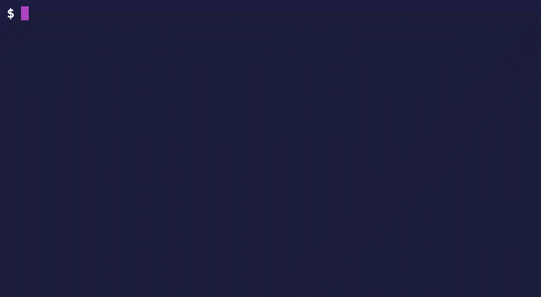
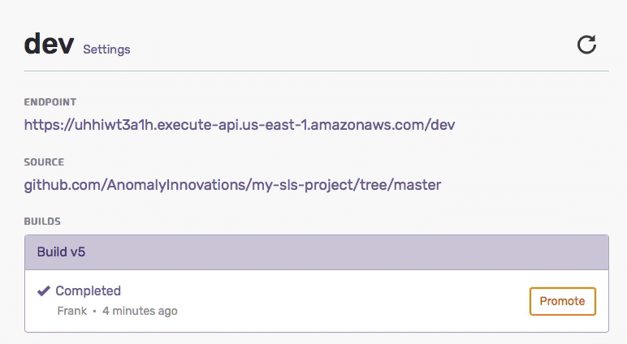
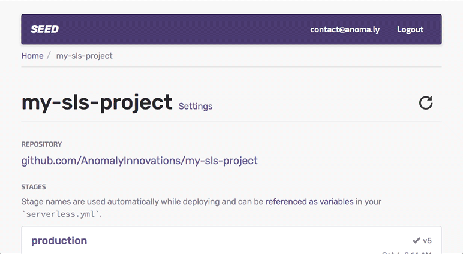
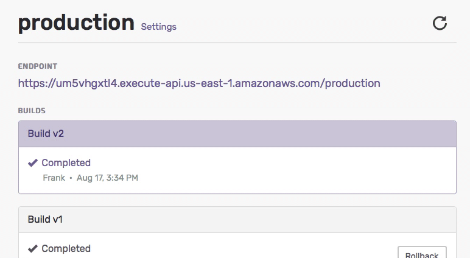

  <h1><a href="/">Seed</a></h1>
  <h4>Simplest way for teams to  build and deploy Serverless apps</h4>
  <a class="action" href="{{ site.console_url }}{{ site.signup }}">Create a Free Account</a>

  

    

      
      
      
    

    <video
      loop
      muted
      preload
      playsinline
      webkit-playsinline
      poster="assets/hero.png"
      onclick="videoClick(this)"
      onloadstart="videoLoadStart(this)"
      oncanplaythrough="videoCanPlayThrough(this)"
    >
      <source src="assets/hero.mp4" type="video/mp4">
      
    </video>
    

      <i class="fa fa-circle-o-notch fa-spin"></i>
    

    

      <i class="fa fa-play"></i>
    

  

  <h4>Nothing to configure. Nothing to install.</h4>
  
Seed is a fully-configured code pipeline for building and deploying Serverless apps on AWS. Simply add your GitHub repository and IAM credentials and your entire team can `git push` to deploy updates to your Serverless app.

  
Here is how it works.

  

  

    

      Push your code to GitHub
    

    

      <i class="fa fa-github"></i>
    

  

  

    
SEED

  

  

    

      Run your tests
    

    

      <i class="fa fa-check-circle"></i>
    

  

  

    

      Package a verified build
    

    

      <i class="fa fa-cogs"></i>
    

  

  

    
Your AWS

  

  

    

      Deploy to staging
    

    

      <i class="fa fa-paper-plane-o"></i>
    

  

  

    

      Promote to production
    

    

      <i class="fa fa-paper-plane"></i>
    

  

  <a class="action" href="{{ site.console_url }}{{ site.signup }}">Create a Free Account</a>
  
A few other things you get out of the box.

  
&#9663;

  

    <h2 id="unlimited-stages">Unlimited Stages</h2>
    
Create a new stage by pointing to a branch in your repository. Each stage automatically gets it’s own endpoint and you can create as many as you like. <a class="more" href="/docs/adding-a-stage.html">Read more on working with stages</a>.

    

      <video
        loop
        muted
        preload
        playsinline
        webkit-playsinline
        poster="assets/stages.png"
        onclick="videoClick(this)"
        onloadstart="videoLoadStart(this)"
        oncanplaythrough="videoCanPlayThrough(this)"
      >
        <source src="assets/stages.mp4" type="video/mp4">
        
      </video>
      

        <i class="fa fa-circle-o-notch fa-spin"></i>
      

      

        <i class="fa fa-play"></i>
      

    

  

  

  

    <h2 id="stage-variables">Stage Variables</h2>
    
Stage variables are automatically supported and don’t need any configuration. Just reference them by the stage name in your `serverless.yml`. <a class="more" href="/docs/configuring-stage-variables.html">Learn more about stage variables</a>.

    

      <video
        loop
        muted
        preload
        playsinline
        webkit-playsinline
        poster="assets/envs.png"
        onclick="videoClick(this)"
        onloadstart="videoLoadStart(this)"
        oncanplaythrough="videoCanPlayThrough(this)"
      >
        <source src="assets/envs.mp4" type="video/mp4">
        
      </video>
      

        <i class="fa fa-circle-o-notch fa-spin"></i>
      

      

        <i class="fa fa-play"></i>
      

    

  

  

  

    <h2 id="preview-pull-requests">Preview Pull RequestsNew</h2>
    
Pull requests are automatically built in Seed. They get their own unique endpoint and use the variables of the stage they are going to be merged into. <a class="more" href="/docs/working-with-pull-requests.html">More on working with pull requests</a>.

    

      <video
        loop
        muted
        preload
        playsinline
        webkit-playsinline
        poster="assets/pull-request.png"
        onclick="videoClick(this)"
        onloadstart="videoLoadStart(this)"
        oncanplaythrough="videoCanPlayThrough(this)"
      >
        <source src="assets/pull-request.mp4" type="video/mp4">
        
      </video>
      

        <i class="fa fa-circle-o-notch fa-spin"></i>
      

      

        <i class="fa fa-play"></i>
      

    

  

  

  

    <h2 id="encrypted-secrets">Encrypted Secrets</h2>
    
Secrets can be securely stored via the <a href="{{ site.console_url }}" target="_blank">Seed Console</a> without having to add them to the `serverless.yml`. They are encrypted using your <a href="https://aws.amazon.com/kms/" target="_blank">AWS KMS</a> keys. <a class="more" href="/docs/storing-secrets.html">Learn about how secrets are stored</a>.

    

      <video
        loop
        muted
        preload
        playsinline
        webkit-playsinline
        poster="assets/secrets.png"
        onclick="videoClick(this)"
        onloadstart="videoLoadStart(this)"
        oncanplaythrough="videoCanPlayThrough(this)"
      >
        <source src="assets/secrets.mp4" type="video/mp4">
        
      </video>
      

        <i class="fa fa-circle-o-notch fa-spin"></i>
      

      

        <i class="fa fa-play"></i>
      

    

  

  

  

    <h2 id="review-changeset">Review Stack ChangesNew</h2>
    
Review your infrastructure changes to double-check any irreversible updates that your Serverless project is about to deploy. <a class="more" href="/docs/promoting-to-production.html">Read more on promoting to production</a>.

    

      <video
        loop
        muted
        preload
        playsinline
        webkit-playsinline
        poster="assets/changeset.png"
        onclick="videoClick(this)"
        onloadstart="videoLoadStart(this)"
        oncanplaythrough="videoCanPlayThrough(this)"
      >
        <source src="assets/changeset.mp4" type="video/mp4">
        
      </video>
      

        <i class="fa fa-circle-o-notch fa-spin"></i>
      

      

        <i class="fa fa-play"></i>
      

    

  

  

  

    <h2 id="1-click-rollback">1-Click Rollback</h2>
    
Rollback to any of your previously verified production builds through the <a href="{{ site.console_url }}" target="_blank">Seed Console</a> with just one click

    

      <video
        loop
        muted
        preload
        playsinline
        webkit-playsinline
        poster="assets/rollback.png"
        onclick="videoClick(this)"
        onloadstart="videoLoadStart(this)"
        oncanplaythrough="videoCanPlayThrough(this)"
      >
        <source src="assets/rollback.mp4" type="video/mp4">
        
      </video>
      

        <i class="fa fa-circle-o-notch fa-spin"></i>
      

      

        <i class="fa fa-play"></i>
      

    

  

  <h4 id="comparison">How Do We Compare?</h4>
  

    

      
Circle/Travis CI

      
vs

      
Seed

    

    <table>
      <tbody>
        <tr>
          <td>Branch  Endpoints</td>
          <td>Needs configurtation</td>
          <td>Included</td>
        </tr>
        <tr>
          <td>Pull Request  Endpoints</td>
          <td>Needs configurtation  and custom code</td>
          <td>Included</td>
        </tr>
        <tr>
          <td>Review  Change Sets</td>
          <td>Custom code with a  manual approval step</td>
          <td>Included</td>
        </tr>
        <tr>
          <td>Concurrent  Builds</td>
          <td>Pay extra for concurrency</td>
          <td>Included</td>
        </tr>
        <tr>
          <td>Rollbacks</td>
          <td>Git revert and re-build</td>
          <td>Rollback to previous production builds</td>
        </tr>
      </tbody>
    </table>
  

<!--

  <h4 id="testimonials">From Our Customers</h4>
  

    

      <h6>Amazing support</h6>
      
&ldquo;I just completed your tutorial on the Serverless stack, and it was fantastic. It was carefully thought out, well-written, and incredibly thorough. You guys rock!&rdquo;

      

        
        
Daniel Chen

        
CTO, <a href="https://myshyft.com">Shyft</a>

      

    

    

      <h6>Saves a lot of time</h6>
      
&ldquo;This is the best and most comprehensive fullstack serverless tutorial available. Take the time to go through every step, you will learn a ton!&rdquo;

      

        
        
Patrick Star

        
CEO, <a href="https://myshyft.com">Krabby Inc.</a>

      

    

    

      <h6>Less things to worry about</h6>
      
&ldquo;Rarely do tutorials neatly break things down into bite-sized steps. Even rarer do they clearly explain what each step is for and why it is necessary. The Serverless-Stack is the Holy Grail that does all three.&rdquo;

      

        
        
Sandy Cheeks

        
CEO, <a href="https://myshyft.com">Chum Bucket</a>

      

    

  

-->

  <h4 id="pricing">Pricing</h4>
  

    
Get started for free

    <ul class="features fa-ul">
      <li>
        <i class="fa-li fa fa-check"></i>
        15 deployments
      </li>
      <li>
        <i class="fa-li fa fa-check"></i>
        Unlimited users
      </li>
      <li>
        <i class="fa-li fa fa-check"></i>
        Unlimited projects
      </li>
      <li>
        <i class="fa-li fa fa-check"></i>
        Unlimited concurrent builds
      </li>
    </ul>
    <a class="action" href="{{ site.console_url }}{{ site.signup }}">Create a Free Account</a>
  

  

    

      

        

          Startup
        

        

          
$7

          
per month

        

      

      <ul class="features fa-ul">
        <li>
          <i class="fa-li fa fa-check"></i>
          Unlimited users
        </li>
        <li>
          <i class="fa-li fa fa-check"></i>
          Unlimited projects
        </li>
        <li>
          <i class="fa-li fa fa-check"></i>
          Unlimited concurrent builds
        </li>
        <li>
          <i class="fa-li fa fa-long-arrow-right"></i>
          60 deployments
        </li>
        <li>
          <i class="fa-li fa fa-circle-thin"></i>
          Pay as you go
        </li>
      </ul>
    

    

      

        

          Standard
        

        

          
$47

          
per month

        

      

      <ul class="features fa-ul">
        <li>
          <i class="fa-li fa fa-check"></i>
          Unlimited users
        </li>
        <li>
          <i class="fa-li fa fa-check"></i>
          Unlimited projects
        </li>
        <li>
          <i class="fa-li fa fa-check"></i>
          Unlimited concurrent builds
        </li>
        <li>
          <i class="fa-li fa fa-long-arrow-right"></i>
          600 deployments
        </li>
        <li>
          <i class="fa-li fa fa-plus"></i>
          Email support
        </li>
      </ul>
    

    

      

        

          Premium
        

        

          
$197

          
per month

        

      

      <ul class="features fa-ul">
        <li>
          <i class="fa-li fa fa-check"></i>
          Unlimited users
        </li>
        <li>
          <i class="fa-li fa fa-check"></i>
          Unlimited projects
        </li>
        <li>
          <i class="fa-li fa fa-check"></i>
          Unlimited concurrent builds
        </li>
        <li>
          <i class="fa-li fa fa-long-arrow-right"></i>
          3000 deployments
        </li>
        <li>
          <i class="fa-li fa fa-plus"></i>
          Priority email support
        </li>
      </ul>
    

    

      

        

          Pro
        

        

          
$997

          
per month

        

      

      <ul class="features fa-ul">
        <li>
          <i class="fa-li fa fa-check"></i>
          Unlimited users
        </li>
        <li>
          <i class="fa-li fa fa-check"></i>
          Unlimited projects
        </li>
        <li>
          <i class="fa-li fa fa-check"></i>
          Unlimited concurrent builds
        </li>
        <li>
          <i class="fa-li fa fa-long-arrow-right"></i>
          18000 deployments
        </li>
        <li>
          <i class="fa-li fa fa-plus"></i>
          Priority email support
        </li>
        <li>
          <i class="fa-li fa fa-plus"></i>
          Video call support
        </li>
        <li>
          <i class="fa-li fa fa-plus"></i>
          Required two-factor auth Coming soon
        </li>
        <li>
          <i class="fa-li fa fa-plus"></i>
          Multi-level user roles Coming soon
        </li>
      </ul>
    

  

  

    

      There are soft limits on build storage and total build minutes. <a href="mailto:{{ site.email }}">Contact us</a> if you have any questions or have custom requirements.
    

    

      All deployments are listed per month.
    

  

  <h4 id="faq">Frequently Asked Questions</h4>
  <ul>
    <li>
      

        Why not just use `serverless deploy`?
      

      

        The deploy command is great when you are working alone but as a part of a team, it does not make sense to grant IAM access to everybody for the production resources. By using Seed’s workflow you can ensure that only verified builds get promoted to production.
      

    </li>

    <li>
      

        What is a verified build?
      

      

        Seed auto-detects and runs any tests your project has. If the tests pass then a build is created for the current stage. It also creates and stores a build for the production stage. This verified build is deployed to production once you decide to promote it.
      

    </li>

    <li>
      

        Where is my Serverless project hosted?
      

      

        The build process is run on our side, while the Serverless project is deployed to your AWS account using your credentials. This ensures that even in the unlikely event of an outage on our side, you’ll still be able to access your API endpoints. We also use your AWS KMS key to encrypt your secrets.
      

    </li>

    <li>
      

        How many concurrent builds can I run?
      

      

        You can create unlimited stages with unlimited concurrent builds using Seed. And you’ll only be charged for the time it takes your builds to run.
      

    </li>

    <li>
      

        Can I configure upstream and downstream stages?
      

      

        Currently the "production" stage is the only downstream stage with all other stages promoting directly to it via the <a href="{{ site.console_url }}" target="_blank">Seed Console</a>.
      

    </li>

    <li>
      

        Is it only for Serverless APIs?
      

      

        Your Serverless project does not need to be an API but we are focusing primarily on APIs.
      

    </li>

    <li>
      

        Which environments do you support?
      

      

        We support <a href="https://serverless.com/framework/" target="_blank">Severless Framework</a> Node.js and Python projects on AWS with GitHub as a source repository. Let us know if there are any other environments you’d like us to support.
      

    </li>
  </ul>
  
Feel free to contact us if you have any questions using the message button or via <a href="mailto:{{ site.email }}">email</a>.

  
Seed is created by the trusted folks behind <a target="_blank" href="http://serverless-stack.com">Serverless-Stack.com</a>,  the best resource for building serverless apps on AWS.

  <a class="action" href="{{ site.console_url }}{{ site.signup }}">Create a Free Account</a>
  

    

      

      &amp;
    

  

  
Stay up to date with product updates from Seed

  <a class="button" href="{{ site.newsletter_signup_form }}" target="_blank">
    Subscribe to our newsletter
  </a>
   
  <a class="button" href="{{ site.twitter }}" target="_blank">
    Follow us on Twitter
  </a>
  

    

      
      <i title="GitHub" class="fa fa-github" aria-hidden="true"></i>
      
      
Supported Platforms

    

    

      <i title="Bitbucket" class="fa fa-bitbucket" aria-hidden="true"></i>
      <i title="GitLab" class="fa fa-gitlab" aria-hidden="true"></i>
      
Coming Soon

    

  

