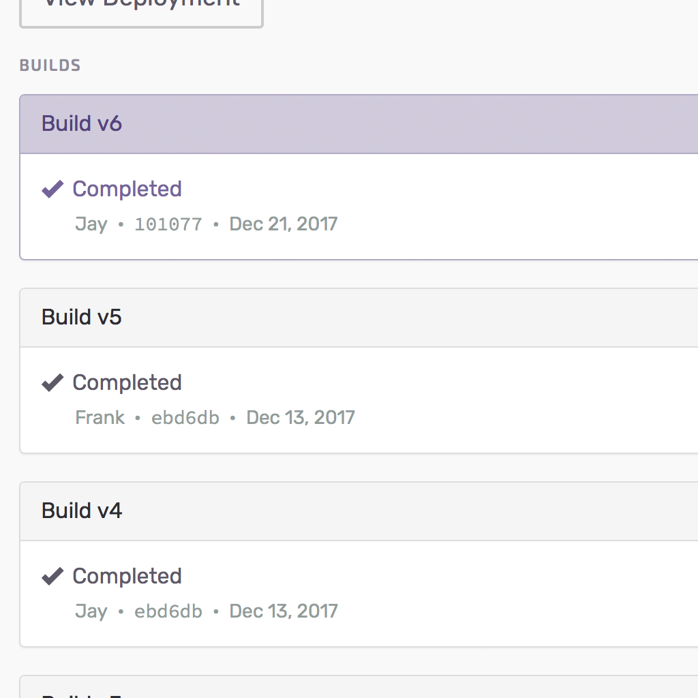
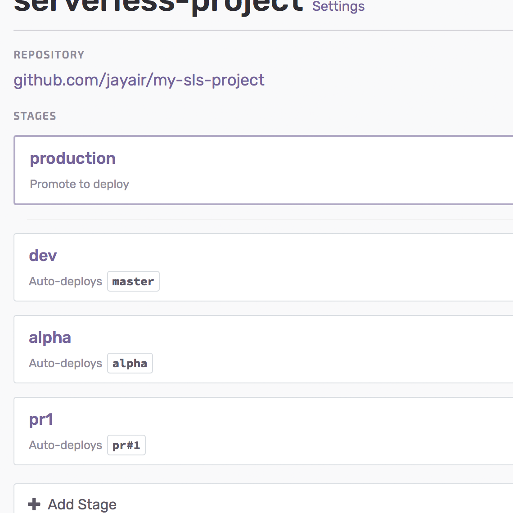
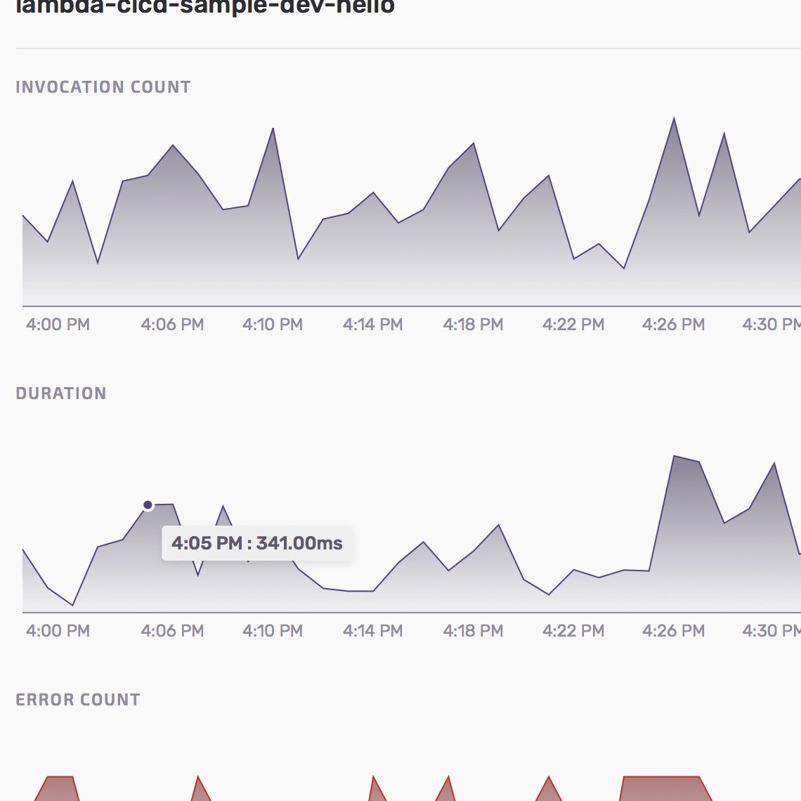

  <h1>Deploy, Manage, and Monitor Serverless Applications on AWS</h1>
  <h3>Seed manages pipelines, configures environments, and monitors deployments for Serverless Framework projects.</h3>
  

    <a class="demo" href="{{ site.console_url }}{{ site.request_demo }}">
      Request a demo
    </a>
    <a class="action" href="{{ site.console_url }}{{ site.signup }}">
      Sign up for free
    </a>
  

  

    

    

  

  

    <iframe id='ytPlayer' width="100%" height="100%" src="https://www.youtube.com/embed/n8N8zRVM5tE?rel=0&amp;controls=1&amp;showinfo=0&amp;autoplay=0&amp;loop=1&amp;enablejsapi=1" frameborder="0" allow="autoplay; encrypted-media" allowfullscreen></iframe>
  

  <h4>Nothing to configure. Nothing to install.</h4>
  
Simply link your Git repository and IAM credentials and you can `git push` to deploy updates to your Serverless app. Create multiple environments for your team, configure custom domains, and view logs and metrics right from the Seed console.

  

    

      
      <i title="Bitbucket" class="fa fa-bitbucket" aria-hidden="true"></i>
      <i title="GitHub" class="fa fa-github" aria-hidden="true"></i>
      <i title="GitLab" class="fa fa-gitlab" aria-hidden="true"></i>
      
    

    

      
    

    

      
    

  

  

    

      

        <i class="fa fa-code-fork" aria-hidden="true"></i>
      

      <h2>Automated Deployments</h2>
      
Seed is a fully-configured code pipeline for Serverless Framework projects on AWS. Here are a few ways Seed can help you with deployments:

      <ul class="fa-ul">
        <li>
          <i class="fa-li fa fa-check-circle-o" aria-hidden="true"></i>
          <a href="/docs/running-tests.html">
            Automatically run tests
          </a>
        </li>
        <li>
          <i class="fa-li fa fa-check-circle-o" aria-hidden="true"></i>
          <a href="/docs/adding-build-notifications.html">
            <b>Slack</b> &amp; email <b>notifications</b>
          </a>
        <li>
          <i class="fa-li fa fa-check-circle-o" aria-hidden="true"></i>
          <a href="/docs/adding-python-projects.html">
            Deploy Python without Docker
          </a>
        </li>
        </li>
        <li>
          <i class="fa-li fa fa-check-circle-o" aria-hidden="true"></i>
          <a href="/docs/rolling-back.html">
            <b>1 click rollback</b> without rebuilding
          </a>
        </li>
        <li>
          <i class="fa-li fa fa-check-circle-o" aria-hidden="true"></i>
          <a href="/docs/promoting-to-production.html">
            <b>Review CloudFormation</b> Change Sets
          </a>
        </li>
      </ul>
    

    

      
    

  

  

  

    

      

        <i class="fa fa-cogs" aria-hidden="true"></i>
      

      <h2>Manage Environments</h2>
      
Create and configure multiple environments for your team. Environments in Seed are based on the stages in Serverless Framework with all the perks:

      <ul class="fa-ul">
        <li>
          <i class="fa-li fa fa-check-circle-o" aria-hidden="true"></i>
          <a href="/docs/configuring-stage-variables.html">
            Add environment variables
          </a>
        </li>
        <li>
          <i class="fa-li fa fa-check-circle-o" aria-hidden="true"></i>
          <a href="/docs/storing-secrets.html">
            <b>Store secrets</b> through the console
          </a>
        </li>
        <li>
          <i class="fa-li fa fa-check-circle-o" aria-hidden="true"></i>
          <a href="/docs/updating-the-stage-source.html">
            Update the branch that is deployed
          </a>
        </li>
        <li>
          <i class="fa-li fa fa-check-circle-o" aria-hidden="true"></i>
          <a href="/docs/working-with-pull-requests.html">
            Automatically <b>preview pull requests</b>
          </a>
        </li>
        <li>
          <i class="fa-li fa fa-check-circle-o" aria-hidden="true"></i>
          <a href="/docs/configuring-custom-domains.html">
            <b>Custom domains</b> for stage endpoints
          </a>
        </li>
      </ul>
    

    

      
    

  

  

  

    

      

        <i class="fa fa-tachometer" aria-hidden="true"></i>
      

      <h2>Monitor Deployments</h2>
      
Once your deployments are live, Seed can pull up detailed information on the deployed stack. And give you a live look at what is going on.

      <ul class="fa-ul">
        <li>
          <i class="fa-li fa fa-check-circle-o" aria-hidden="true"></i>
          <a href="/docs/viewing-logs.html">
            <b>Live</b> Access &amp; Lambda <b>logs</b>
          </a>
        </li>
        <li>
          <i class="fa-li fa fa-check-circle-o" aria-hidden="true"></i>
          <a href="/docs/storing-secrets.html">
            <b>Live</b> Lambda &amp; API Gateway <b>metrics</b>
          </a>
        </li>
      </ul>
    

    

      
    

  

  

  

    

      <i class="fa fa-list-alt" aria-hidden="true"></i>
    

    

      <h4>Large Serverless Projects?</h4>
      

        Working on a mono-repo or multi-repo Serverless project and would like to use Seed? We are currently adding support for larger projects. Contact us for early access.
      

      <a href="mailto:{{ site.email }}?subject=I%20would%20like%20support%20for%20larger%20projects%20in%20Seed">
        Request early access
      </a>
    

  

  <h4 id="testimonials">From Our Lovely Customers</h4>
  

    

      
&ldquo;Seed has made deploying and managing our Serverless apps super slick. Prior to Seed, we’d looked at using services like Circle to handle our CI/CD, but so much configuration was needed for them to work well with Serverless. Plus the team at Seed are really helpful and responsive, which is vital when you’re working with new technology.&rdquo;

      

        
Lewis Blackwood

        
CTO, <a target="_blank" href="https://personably.co">Personably</a>

      

    

    

      
&ldquo;Seed has made it possible for us to use Serverless at Shyft. We don’t need to spend time configuring environments and managing our workflows. It also gives us great control over our deployments and it has reduced our DevOps spend significantly.&rdquo;

      

        
Daniel Chen

        
CTO, <a target="_blank" href="https://myshyft.com">Shyft</a>

      

    

  

  <h4 id="pricing">Pricing</h4>
  

    

      

        

          Free
        

        

          
$0

          
per month

        

      

      <ul class="features fa-ul">
        <li>
          <i class="fa-li fa fa-check"></i>
          Unlimited users
        </li>
        <li>
          <i class="fa-li fa fa-check"></i>
          Unlimited projects
        </li>
        <li>
          <i class="fa-li fa fa-check"></i>
          Unlimited concurrent builds
        </li>
        <li>
          <i class="fa-li fa fa-long-arrow-right"></i>
          15 deploys per month
        </li>
      </ul>
    

    

      

        

          Startup
        

        

          
$7

          
per month

        

      

      <ul class="features fa-ul">
        <li>
          <i class="fa-li fa fa-check"></i>
          Unlimited users
        </li>
        <li>
          <i class="fa-li fa fa-check"></i>
          Unlimited projects
        </li>
        <li>
          <i class="fa-li fa fa-check"></i>
          Unlimited concurrent builds
        </li>
        <li>
          <i class="fa-li fa fa-long-arrow-right"></i>
          60 deploys per month
        </li>
        <li>
          <i class="fa-li fa fa-circle-thin"></i>
          Add 60 deploys for $7
        </li>
      </ul>
    

    

      

        

          Standard
        

        

          
$47

          
per month

        

      

      <ul class="features fa-ul">
        <li>
          <i class="fa-li fa fa-check"></i>
          Unlimited users
        </li>
        <li>
          <i class="fa-li fa fa-check"></i>
          Unlimited projects
        </li>
        <li>
          <i class="fa-li fa fa-check"></i>
          Unlimited concurrent builds
        </li>
        <li>
          <i class="fa-li fa fa-long-arrow-right"></i>
          600 deploys per month
        </li>
        <li>
          <i class="fa-li fa fa-plus"></i>
          Email support
        </li>
      </ul>
    

    

      

        

          Premium
        

        

          
$197

          
per month

        

      

      <ul class="features fa-ul">
        <li>
          <i class="fa-li fa fa-check"></i>
          Unlimited users
        </li>
        <li>
          <i class="fa-li fa fa-check"></i>
          Unlimited projects
        </li>
        <li>
          <i class="fa-li fa fa-check"></i>
          Unlimited concurrent builds
        </li>
        <li>
          <i class="fa-li fa fa-long-arrow-right"></i>
          3000 deploys per month
        </li>
        <li>
          <i class="fa-li fa fa-plus"></i>
          Priority email support
        </li>
      </ul>
    

    

      

        

          Pro
        

        

          
$997

          
per month

        

      

      <ul class="features fa-ul">
        <li>
          <i class="fa-li fa fa-check"></i>
          Unlimited users
        </li>
        <li>
          <i class="fa-li fa fa-check"></i>
          Unlimited projects
        </li>
        <li>
          <i class="fa-li fa fa-check"></i>
          Unlimited concurrent builds
        </li>
        <li>
          <i class="fa-li fa fa-long-arrow-right"></i>
          18000 deploys per month
        </li>
        <li>
          <i class="fa-li fa fa-plus"></i>
          Priority email support
        </li>
        <li>
          <i class="fa-li fa fa-plus"></i>
          Video call consultations
        </li>
        <li>
          <i class="fa-li fa fa-plus"></i>
          Required two-factor auth Coming soon
        </li>
        <li>
          <i class="fa-li fa fa-plus"></i>
          Multi-level user roles Coming soon
        </li>
      </ul>
    

  

  

    
{{ site.tel }}

    

      <a class="demo" href="{{ site.console_url }}{{ site.request_demo }}">
        Request a demo
      </a>
      <a class="action" href="{{ site.console_url }}{{ site.signup }}">
        Sign up for free
      </a>
    

  

  

    

    

      There are soft limits on build storage and total build minutes. <a href="mailto:{{ site.email }}">Contact us</a> if you have any questions or have custom requirements.
    

  

  
Seed is created by the trusted folks behind <a target="_blank" href="http://serverless-stack.com">Serverless-Stack.com</a>,  the best resource for building serverless apps on AWS.

  
<a href="/about.html">Learn more about us</a>

  

    

      

      &amp;
    

  

  
Stay up to date with product updates from Seed

  <a class="button" href="{{ site.newsletter_signup_form }}" target="_blank">
    Subscribe to our newsletter
  </a>
   
  <a class="button" href="{{ site.twitter }}" target="_blank">
    Follow us on Twitter
  </a>

